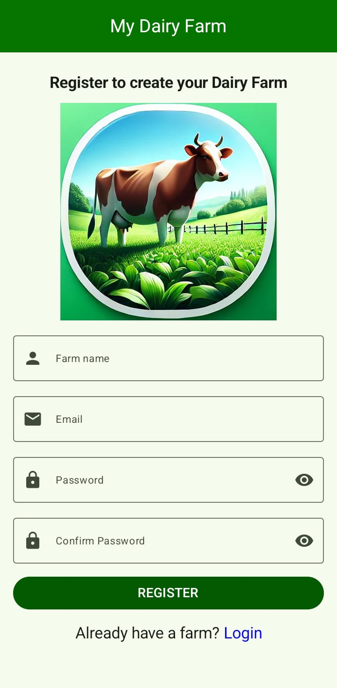
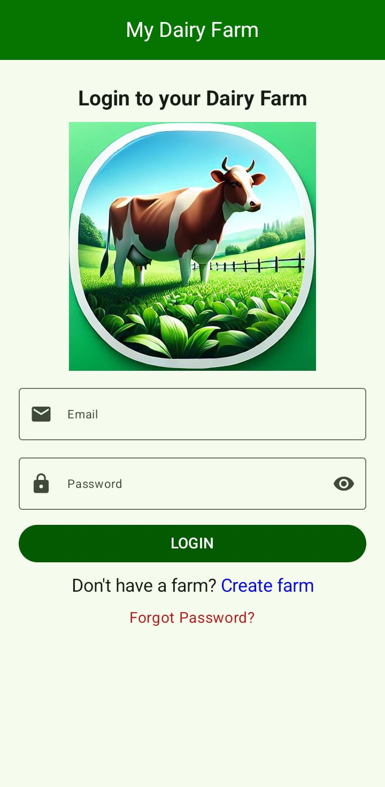

My Dairy Farm App
=================

This is the repository for the My Dairy Farm app. **It is a work in progress** 🚧.

**My Dairy Farm** is a fully functional Android app built entirely with ***Kotlin*** and ***Jetpack Compose***.
It follows Android design and development best practices and is designed to aid dairy farmers 
digitally manage cow records, monitor reproductive status, and make informed farming decisions. 
The application focuses on simplicity, accuracy, and automation of common dairy farm record-keeping tasks.

# Features
- Add and manage cow records (name, age, date of birth, mother’s name)
- Track insemination records and pregnancy status
- Automatic pregnancy duration and expected due-date calculation
- Color-coded pregnancy progress indicators
- Search cows by name
- Sort cows by expected due date
- Firebase Authentication (secure user access)
- Firebase Realtime Database for data persistence
- Modern UI built with Jetpack Compose

## Screenshots

### Register & Login screens
   

# Development Environment
- **Language**: Kotlin
- **IDE**: Android Studio (Giraffe or newer)
- **Minimum SDK**: API 24
- **Target SDK**: API 34
- **Build System**: Gradle (Kotlin DSL)
- **UI Toolkit**: Jetpack Compose
- **Backend Services**: Firebase Authentication, Firebase Realtime Database
- **Version Control**: Git & GitHub

# Architecture
The project follows the **MVVM (Model–View–ViewModel)** architecture to ensure separation of concerns, 
testability, and maintainability.
### Key Layers
- **UI (View)**: Jetpack Compose screens
- **ViewModel**: Handles UI state and business logic
- **Repository**: Acts as a single source of truth for data
- **Data Layer**: Firebase services and models

  State management is handled using:
    - State
    - mutableStateOf
    - StateFlow (where applicable)

# UI (User Interface)
- Built entirely with Jetpack Compose
- Material 3 design system
- Responsive layouts
- Progress indicators for pregnancy stages
- Clean, minimal, and farmer-friendly navigation

  The UI prioritizes:
    - Simplicity
    - Readability
    - Fast access to critical farm data

# Future Enhancements
- Milk production tracking
- Cow health and vaccination records
- Offline-first support
- Data analytics and reporting
- Cloud backup and restore

# 👨‍💻 Author
### Erick Ithandi
Junior Android Developer
Kotlin | Jetpack Compose | Firebase | MVVM

# 📄 License
This project is for educational and portfolio purposes.